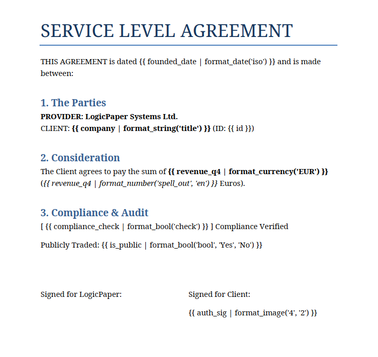
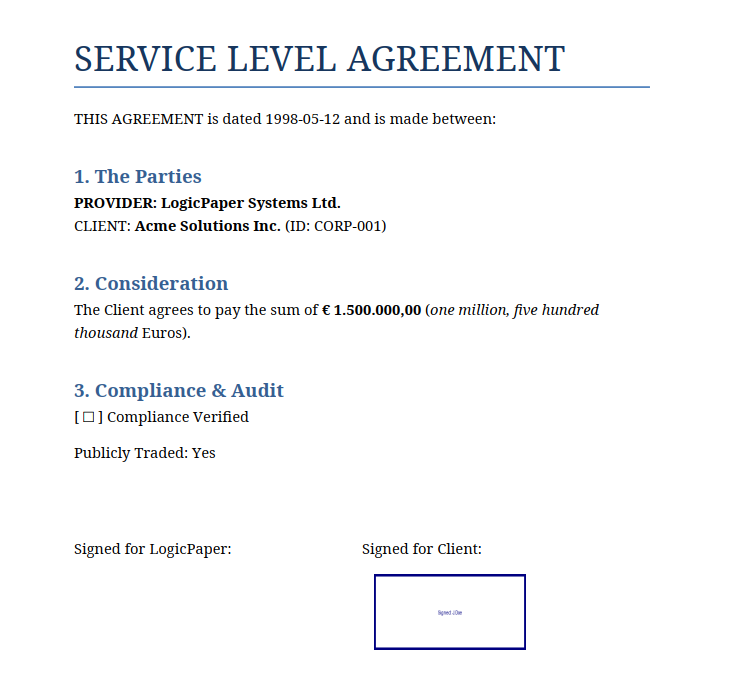
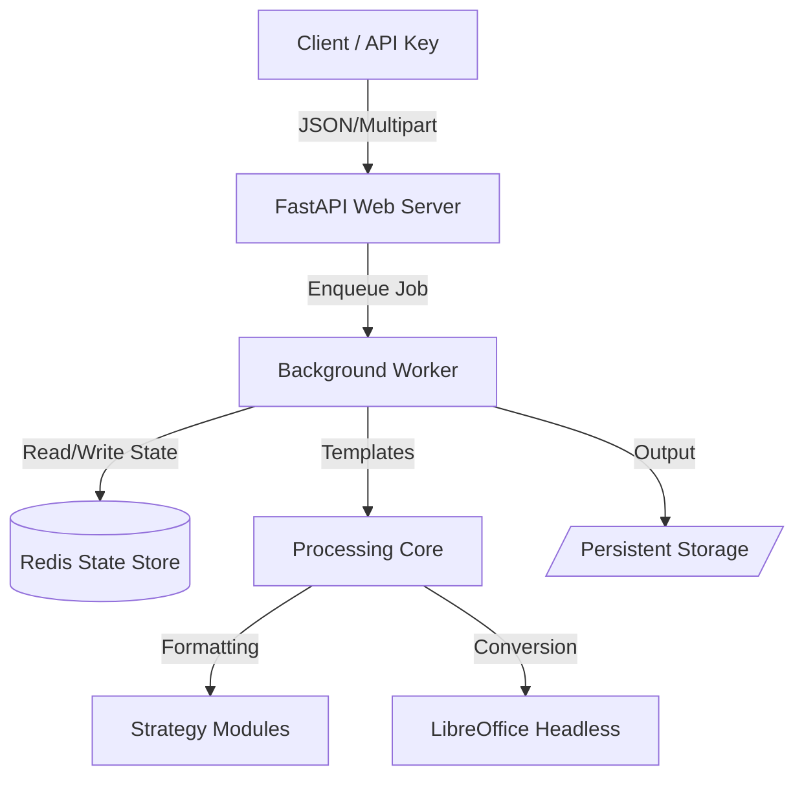

# LogicPaper | Document Generation Engine


<div align="center">
  <a href="README_pt.md"><strong>Leia em Português</strong></a>
  <br><br>
  <a href="CONTRIBUTING.md"><strong>Contributing Guide</strong></a>
</div>

---

## 📖 Overview

**LogicPaper** is a high-performance document generation engine designed to automate complex reporting and contract workflows. It merges structured data (Excel/JSON) with Microsoft Office templates (`.docx`, `.pptx`) or text-based files (`.md`, `.txt`) using an advanced Jinja2-based strategy system.

The application follows an **Enterprise Architecture** (Hexagonal Architecture), utilizing **FastAPI** for high-concurrency requests, **Redis** for state management, and **LibreOffice Headless** for reliable PDF conversion.

### 🖼️ System Preview

### Dashboard Interface


*Drag & Drop interface with real-time process logs.*

### Documentation & Help


*Built-in guide for templating syntax.*

---

## 🌟 Key Features

* **Asynchronous Batch Processing:** Handles large datasets via background workers to prevent request timeouts.
* **Multi-Format Support:** Native rendering for Word, PowerPoint, Markdown, and Plain Text.
* **Enterprise Integration API:** Dedicated headless endpoints with X-API-Key authentication for ERP/CRM integration.
* **State Persistence:** Job tracking and session management powered by Redis.
* **Complex Formatting Strategies:** Custom filters for text manipulation, date arithmetic, localized currency, and conditional logic.
* **Dynamic Asset Management:** Automatic extraction, insertion, and resizing of images from ZIP archives.
* **PDF Engine:** Integrated LibreOffice for high-fidelity conversion of Office documents to PDF.

---

## ⚡ Example

See how **LogicPaper** transforms raw data into professional documents instantly.

### 1. Input Data (JSON)

This is the mock data feeding the system:

```json
{
    "id": "CORP-001",
    "company": "Acme Solutions Inc.",
    "founded_date": "1998-05-12",
    "revenue_q4": "1500000.00",
    "is_public": "TRUE",
    "compliance_check": "FALSE",
    "auth_sig": "sig_valid.png"
}
```

### 2. Visual Result (Before & After)

| Template (Input) | Generated Document (Output) |
| :---: | :---: |
| **Model with Jinja2 Tags** | **Rendered PDF with Data** |
|  |  |
| [📄 View Template PDF](docs/files/contract_template.pdf) | [📃 View Result PDF](docs/files/contract_acme_result.pdf) |

---

## 🔄 System Architecture



---

## 🛠️ Project Structure

```text
LogicPaper/
├── app/
│   ├── core/                  # Core Business Logic
│   │   ├── engine.py          # Document Rendering Engine
│   │   ├── formatter.py       # Strategy Dispatcher
│   │   ├── batch.py           # Batch Execution Logic
│   │   └── strategies/        # Formatting Logic (Date, Number, String, etc.)
│   ├── integration/           # Headless API Layer
│   │   ├── router.py          # API Endpoints
│   │   ├── state.py           # Redis Persistence Layer
│   │   └── worker.py          # Background Job Execution
│   ├── main.py                # FastAPI Main Application & UI Routes
│   └── utils.py               # Shared Utilities & Schedulers
├── static/                    # Frontend UI (HTML/CSS/JS)
├── persistent_templates/      # Storage for API Template Library
├── data/                      # Docker Volume for Temp Files
├── Dockerfile                 # Image definition
└── docker-compose.yml         # Container orchestration
```

---

## 🚀 Quick Start

### Prerequisites

* **Docker Desktop** (20.10+)
* **Docker Compose**

### Installation & Deployment

1. **Clone the Repository**

    ```bash
    git clone https://github.com/rubensbraz/LogicPaper.git
    cd LogicPaper
    ```

2. **Configure Environment**
    Create a `.env` file based on the provided configuration (ensure `LOGICPAPER_API_KEY` is set).

3. **Start Services**

    ```bash
    docker-compose up --build
    ```

4. **Access**
    * **UI Dashboard:** `http://localhost:8000`
    * **API Documentation:** `http://localhost:8000/docs`

---

## 💻 API Integration

LogicPaper provides a dedicated integration layer for external systems.

* **Endpoint:** `POST /api/v1/integration/generate`
* **Authentication:** `X-API-Key` header.
* **Workflow:** Submit a JSON payload with data and template path; receive a `job_id` to poll for status and download the result.

---

## 📘 Templating Syntax

LogicPaper uses the pipe character (`|`) to apply formatting filters to variables.
*For a complete list of filters, refer to the "How to Use" section in the application ([Documentation in Github Pages](https://rubensbraz.github.io/LogicPaper/help.html)).*

### 1. Text Formatting

```jinja2
{{ client_name | format_string('upper') }}         -> "ACME CORP"
{{ client_id | format_string('prefix', 'ID: ') }}  -> "ID: 12345"
```

### 2. Numbers & Currency

```jinja2
{{ contract_value | format_number('currency', 'USD') }}  -> "$ 1,500.00"
{{ tax_rate | format_number('percent') }}                -> "12.50%"
{{ total | format_number('spell_out', 'en') }}           -> "one thousand five hundred"
```

### 3. Date Operations

```jinja2
{{ start_date | format_date('long', 'en') }}      -> "January 12, 2024"
{{ start_date | format_date('add_days', '30') }}  -> "2024-02-11"
```

### 4. Conditional Logic

Map status codes or values directly in the document:

```jinja2
{{ status_code | format_logic(
    '10=Approved',
    '20=Pending',
    'default', 'Unknown'
) }}
```

### 5. Data Masking

```jinja2
{{ email | format_mask('email') }}                    -> "j***@domain.com"
```

### 6. Images

```jinja2
{{ photo_filename | format_image('3', '4') }}         -> (Resizes image to 3x4cm)
```

---

## 🤝 Contributing

**LogicPaper** is an open-source project and we love community contributions!

Whether you want to implement a new feature from our **Roadmap**, fix a bug, or improve documentation, please check our [Contributing Guidelines](CONTRIBUTING.md) before getting started.

---

## ⚖️ License (CC BY-NC 4.0)

This project is licensed under the **Creative Commons Attribution-NonCommercial 4.0 International License**.

[](http://creativecommons.org/licenses/by-nc/4.0/)

### You are free to

* **Share:** Copy and redistribute the material in any medium or format.
* **Adapt:** Remix, transform, and build upon the material.

### Under the following terms

1. **Attribution:** You must give appropriate credit to **Rubens Braz**, provide a link to the license, and indicate if changes were made.
2. **NonCommercial:** You may **NOT** use the material for commercial purposes (selling the software, using it for paid services, or integrating it into commercial products).

*To view a copy of this license, visit [http://creativecommons.org/licenses/by-nc/4.0/](http://creativecommons.org/licenses/by-nc/4.0/)*

---

## 👨‍💻 Author

**[Rubens Braz](https://rubensbraz.com/)**

> *"Automation is not about laziness; it's about precision."*
