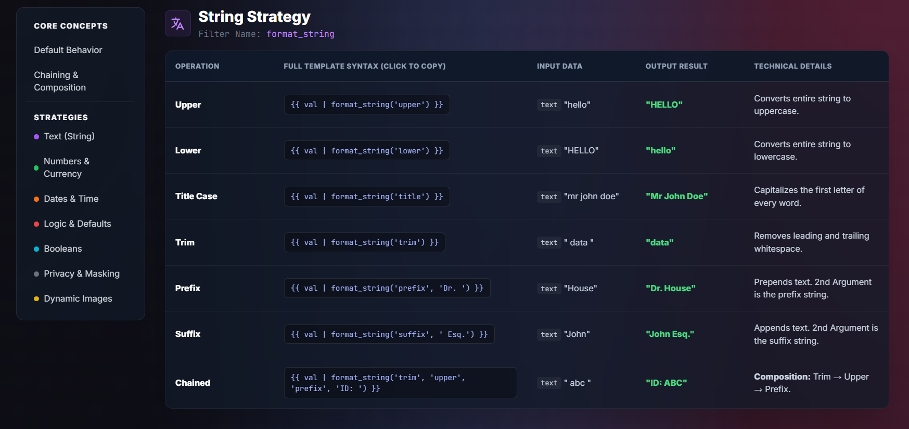
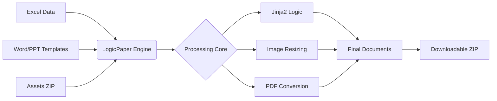

# LogicPaper | Document Generation Engine


<div align="center">
  <a href="README_pt.md"><strong>Leia em Português</strong></a>
</div>

> **Automate the creation of Word, PowerPoint, and PDF documents from Excel data.**

---

## 📖 Overview

**LogicPaper** is a tool designed to automate document creation workflows. It takes structured data from Excel files and populates Microsoft Office templates (`.docx`, `.pptx`) and (`.md`, `.txt`) using a custom Jinja2-based templating system.

Developed with **FastAPI** and **Docker**, it provides a web-based dashboard for managing batch jobs and includes a headless LibreOffice integration for converting generated documents into PDF format. It is suitable for generating contracts, reports, certificates, and presentations at scale.

### 🌟 Key Features

* **Batch Processing:** Efficiently processes multiple rows of data from Excel files.
* **Format Support:** Compatible with standard Word (`.docx`), PowerPoint (`.pptx`), Markdown (`.md`) and Plain Text (`.txt`).
* **Templating Logic:** Includes filters for text manipulation, date arithmetic, currency formatting, and conditional logic directly within the template.
* **Asset Management:** Supports dynamic insertion and resizing of images (e.g., photos, signatures) from a ZIP archive.
* **PDF Conversion:** Integrated LibreOffice for reliable conversion of Office files to PDF.
* **Web Dashboard:** A clean user interface to upload files, monitor progress, and download results.

---

## 🖼️ System Preview

### Dashboard Interface

*Drag & Drop interface with real-time process logs.*

### Documentation & Help

*Built-in guide for templating syntax.*

---

## 🔄 How It Works



---

## 🚀 Quick Start

### Prerequisites

* **Docker Desktop** (version 20.10+)
* **Docker Compose**

### Installation

1.  **Clone the Repository**
    ```bash
    git clone https://github.com/rubensbraz/LogicPaper.git
    cd LogicPaper
    ```

2.  **Start the Engine**
    ```bash
    docker-compose up --build
    ```

3.  **Access the Application**
    Open your browser and navigate to:
    `http://localhost:8000`

---

## 🛠️ Project Structure

The project separates the processing logic (backend) from the user interface (frontend).

```text
LogicPaper/
├── app/
│   ├── core/
│   │   ├── engine.py          # Document Processing (docx/pptx/pdf)
│   │   ├── formatter.py       # Filter Dispatcher
│   │   ├── validator.py       # Template Checker
│   │   └── strategies/        # Formatting Logic Modules
│   │       ├── base.py
│   │       ├── date_std.py    # Date Formatting
│   │       ├── logic_std.py   # Conditional Logic
│   │       └── ...
│   ├── main.py                # FastAPI Application
│   └── utils.py               # Utilities
├── static/                    # Frontend Assets (HTML/CSS/JS)
├── data/                      # Docker Volume for Data
├── Dockerfile                 # Image definition
└── docker-compose.yml         # Container orchestration
```

---

## 📘 Templating Syntax

LogicPaper uses the pipe character (`|`) to apply formatting filters to variables.
*For a complete list of filters, refer to the "How to Use" section in the application ([Documentation in Github Pages](https://rubensbraz.github.io/LogicPaper/help.html)).*

### 1. Text Formatting
```jinja2
{{ client_name | format_string('upper') }}            -> "ACME CORP"
{{ client_id | format_string('prefix', 'ID: ') }}     -> "ID: 12345"
```

### 2. Numbers & Currency
```jinja2
{{ contract_value | format_currency('USD') }}         -> "$ 1,500.00"
{{ tax_rate | format_number('percent', '2') }}        -> "12.50%"
{{ total | format_number('spell_out', 'en') }}        -> "one thousand five hundred"
```

### 3. Date Operations
```jinja2
{{ start_date | format_date('long') }}                -> "January 12, 2024"
{{ start_date | format_date('add_days', '30') }}      -> "2024-02-11"
```

### 4. Conditional Logic
Map status codes or values directly in the document:
```jinja2
{{ status_code | format_logic(
    '10=Approved',
    '20=Pending',
    'default', 'Unknown'
) }}
```

### 5. Data Masking
```jinja2
{{ email | format_mask('email') }}                    -> "j***@domain.com"
```

### 6. Images
```jinja2
{{ photo_filename | format_image('3', '4') }}         -> (Resizes image to 3x4cm)
```

---

## 🧪 Testing

A utility script is included to generate sample data for testing purposes.

1.  **Generate Sample Data (Inside Container):**
    ```bash
    docker exec -it logicpaper python /data/mock_data/generate_seeds.py
    ```
    *This creates a `mock_data.xlsx`, `assets.zip`, and sample templates in the data folder.*

2.  **Run Test:**
    Upload the generated files to the dashboard to verify the output.

---

## ⚖️ License (CC BY-NC 4.0)

This project is licensed under the **Creative Commons Attribution-NonCommercial 4.0 International License**.

[](http://creativecommons.org/licenses/by-nc/4.0/)

### You are free to:
* **Share:** Copy and redistribute the material in any medium or format.
* **Adapt:** Remix, transform, and build upon the material.

### Under the following terms:
1.  **Attribution:** You must give appropriate credit to **Rubens Braz**, provide a link to the license, and indicate if changes were made.
2.  **NonCommercial:** You may **NOT** use the material for commercial purposes (selling the software, using it for paid services, or integrating it into commercial products).

*To view a copy of this license, visit [http://creativecommons.org/licenses/by-nc/4.0/](http://creativecommons.org/licenses/by-nc/4.0/)*

---

## 👨‍💻 Author

**[Rubens Braz](https://rubensbraz.com/)**

---

> *"Automation is not about laziness; it's about precision."*