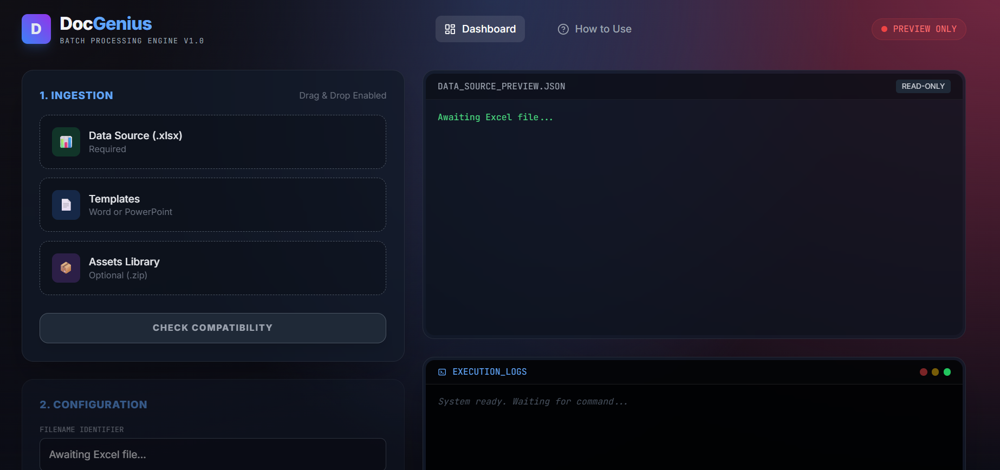

# DocGenius | Batch Document Engine


> **The automation engine for transforming raw Excel data into high-fidelity Word, PowerPoint, and PDF documents.**

---

## 📖 Overview

**DocGenius** is a robust, containerized application designed to solve the "Last Mile" problem of data processing: **Presentation**. It ingests structured data from Excel, applies complex business logic via custom Jinja2 strategies, and populates Microsoft Office templates to generate thousands of documents in seconds.

Built with **FastAPI** and **Docker**, it features a modern "Glassmorphism" UI for real-time batch monitoring and a headless LibreOffice engine for enterprise-grade PDF conversion.

### 🌟 Key Features

* **⚡ High-Performance Batching:** Process thousands of rows asynchronously.
* **🎨 Template Agnostic:** Works natively with `.docx` (Word) and `.pptx` (PowerPoint).
* **🧠 Logic Strategies:** Advanced filters for formatting dates, currency, masks (GDPR), and boolean logic directly inside templates.
* **📷 Dynamic Assets:** Inject and resize images/signatures dynamically from a ZIP library.
* **📄 Native PDF Conversion:** Integrated Headless LibreOffice for perfect file conversion.
* **📡 Real-Time Telemetry:** Server-Sent Events (SSE) provide a live terminal-like experience in the browser.
* **🛡️ Fail-Safe Iteration:** A single corrupted row never stops the batch. Errors are logged, and the engine moves on.

---

## 🖼️ Dashboard Preview


*(Screenshot of Glassmorphism UI here)*

---

## 🚀 Quick Start

### Prerequisites

* **Docker Desktop** (version 20.10+)
* **Docker Compose**

### Installation

1.  **Clone the Repository**
    ```bash
    git clone https://github.com/rubensbraz/docgenius.git
    cd docgenius
    ```

2.  **Start the Engine**
    ```bash
    docker-compose up --build
    ```

3.  **Access the Application**
    Open your browser and navigate to:
    `http://localhost:8000`

---

## 🛠️ Architecture & Project Structure

The project follows a clean architecture pattern, separating core logic (strategies) from the API layer.

```text
DocGenius/
├── app/
│   ├── core/
│   │   ├── engine.py          # Core Document Processing Logic (Docx/Pptx/Pdf)
│   │   ├── formatter.py       # Strategy Dispatcher
│   │   ├── validator.py       # Template Compatibility Checker
│   │   └── strategies/        # The Logic Brain
│   │       ├── base.py        # Abstract Base Class
│   │       ├── date_std.py    # Date Arithmetic & Formatting
│   │       ├── logic_std.py   # Switch/Case & Fallback Logic
│   │       ├── mask_std.py    # Privacy Masking (GDPR)
│   │       └── ...
│   ├── main.py                # FastAPI Entry Point & Routes
│   └── utils.py               # File Handling & Scheduler
├── static/                    # Frontend Assets (Glassmorphism UI)
│   ├── css/
│   ├── js/
│   └── index.html
├── data/                      # Persistence Volume (Docker)
├── Dockerfile                 # Alpine-based Image with LibreOffice
├── docker-compose.yml         # Orchestration
└── requirements.txt           # Python Dependencies
```

---

## 📘 Templating Guide (Strategies)

DocGenius uses a powerful **Piping Syntax** (`|`) to transform data. Below is the complete reference for the available strategies.

### 1. String Manipulation
Control text casing, trimming, and concatenation.
| Filter | Usage | Description |
| :--- | :--- | :--- |
| `upper` | `{{ val \| format_string('upper') }}` | CONVERTS TO UPPERCASE |
| `title` | `{{ val \| format_string('title') }}` | Title Case Format |
| `prefix` | `{{ val \| format_string('prefix', 'ID: ') }}` | Adds text *before* value |
| `truncate` | `{{ val \| format_string('truncate', '10') }}` | Cuts text to N chars |

### 2. Number & Currency
Enterprise financial formatting with localization support.
| Filter | Usage | Description |
| :--- | :--- | :--- |
| `currency` | `{{ val \| format_currency('USD') }}` | $ 1,500.00 |
| `percent` | `{{ val \| format_number('percent', '2') }}` | 0.5 -> 50.00% |
| `spell_out`| `{{ val \| format_number('spell_out', 'en') }}`| 100 -> "one hundred" |

### 3. Date Logic
Parses ISO dates and performs arithmetic without showing time (00:00:00).
| Filter | Usage | Description |
| :--- | :--- | :--- |
| `long` | `{{ dt \| format_date('long') }}` | January 12, 2024 |
| `add_days` | `{{ dt \| format_date('add_days', '30') }}` | Adds 30 days to date |
| `year` | `{{ dt \| format_date('year') }}` | Extracts just the year |

### 4. Enterprise Logic (Switch/Case)
Handle complex mappings and fallbacks directly in the template.
```jinja2
{{ status_code | format_logic(
    '10=Approved', 
    '20=Pending Review', 
    '30=Rejected', 
    'default', 'Unknown Status'
) }}
```

### 5. Privacy Masking (GDPR)
Protect sensitive PII data in non-secure documents.
| Filter | Usage | Output |
| :--- | :--- | :--- |
| `email` | `{{ mail \| format_mask('email') }}` | j***@domain.com |
| `credit_card`| `{{ cc \| format_mask('credit_card') }}` | **** **** **** 1234 |

### 6. Dynamic Images
Inject images from the Assets ZIP, resizing them on the fly.
```jinja2
{{ photo_filename | format_image('width_cm', 'height_cm') }}
Example: {{ client_photo | format_image('3', '4') }}
```

---

## 🧪 Testing & Mock Data

The system includes a `generate_seeds.py` script to create a robust testing environment.

1.  **Generate Seeds:**
    ```bash
    docker exec -it docgenius python /data/mock_data/generate_seeds.py
    ```
    *Creates: `mock_data.xlsx` (5 scenarios), `assets.zip`, and 5 high-fidelity Templates.*

2.  **Run Sample:**
    Upload these files to the Dashboard to test the "Happy Path", "Edge Cases", and "Error Handling".

---

## ⚙️ Configuration (Environment)

Configure the system via `docker-compose.yml`:

```yaml
environment:
  - TEMP_DIR=/data/temp        # Internal processing path
  - TZ=America/Sao_Paulo       # Timezone for logs
  - PYTHONUNBUFFERED=1         # Real-time logging
```

---

## ⚖️ License & Usage Terms (Non-Commercial)

**⚠️ IMPORTANT: READ CAREFULLY BEFORE USE**

This software is licensed under a custom **Non-Commercial, Attribution-Required License**.

### Permitted Uses:
1.  **Personal Use:** You are free to use this software for personal projects, learning, or non-profit activities.
2.  **Modification:** You may modify, adapt, and build upon this code for your own personal use.

### Restrictions:
1.  **No Commercial Use:** You may **NOT** use this software, or any derivatives of it, for commercial purposes, including but not limited to: selling generated documents, using it as a backend for a paid SaaS, or integrating it into a proprietary commercial product.
2.  **Redistribution:** If you redistribute this code (modified or unmodified), you **MUST** retain the original copyright notices and attribution to the original author. You cannot sublicense this code under different terms.

**By using this software, you agree to these terms.**

---

## 👨‍💻 Author & Acknowledgments

**Created by Rubens Braz**

* **Frontend:** HTML5, TailwindCSS, Vanilla JS (Glassmorphism Design).
* **Backend:** FastAPI, Python 3.11.
* **Engine:** LibreOffice (PDF), Python-docx, Python-pptx.

---

> *"Automation is not about laziness; it's about precision."*