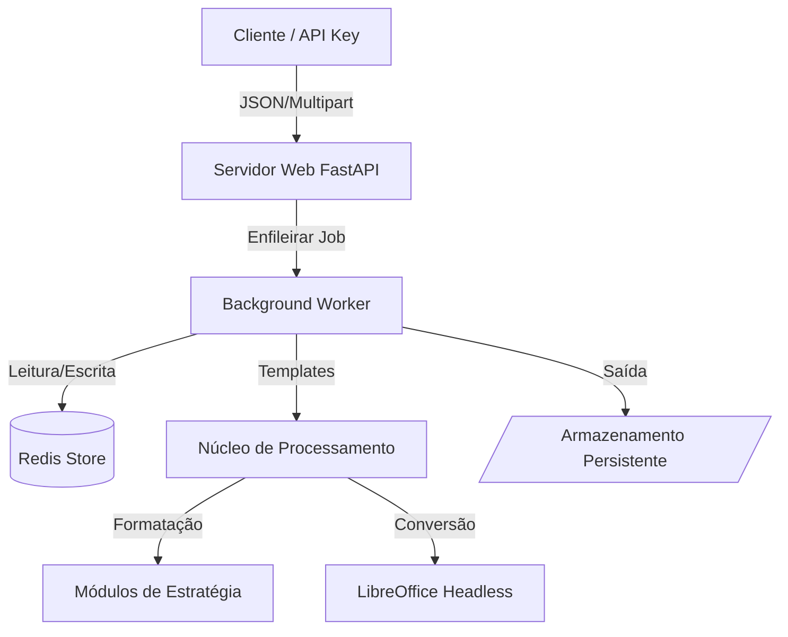

# LogicPaper | Motor de Geração de Documentos


<div align="center">
  <a href="README.md"><strong>Read in English</strong></a>
</div>

---

## 📖 Visão Geral

O **LogicPaper** é um motor de geração de documentos de alta performance, projetado para automatizar fluxos complexos de relatórios e contratos. Ele combina dados estruturados (Excel/JSON) com modelos de Microsoft Office (`.docx`, `.pptx`) ou arquivos de texto (`.md`, `.txt`) através de um sistema avançado de estratégias baseado em Jinja2.

A aplicação segue uma **Arquitetura Enterprise** (Arquitetura Hexagonal), utilizando **FastAPI** para alta concorrência, **Redis** para gerenciamento de estado e persistência de jobs, e **LibreOffice Headless** para conversão confiável de arquivos Office para PDF.

### 🖼️ Prévia do Sistema

### Interface da Dashboard


*Interface Drag & Drop com logs de processo em tempo real.*

### Documentação & Ajuda


*Guia integrado para sintaxe de templates.*

---

## 🌟 Principais Recursos

* **Processamento Assíncrono em Lote:** Gerenciamento de grandes volumes de dados via workers em segundo plano, evitando timeouts de requisição.
* **Suporte Multi-Formato:** Renderização nativa para Word, PowerPoint, Markdown e Texto Simples.
* **API de Integração:** Endpoints dedicados para integração com sistemas externos (ERP/CRM) via autenticação X-API-Key.
* **Persistência de Estado:** Rastreamento de jobs e gerenciamento de sessões utilizando Redis.
* **Estratégias de Formatação Complexas:** Filtros customizados para manipulação de strings, aritmética de datas, moedas localizadas e lógica condicional.
* **Gestão Dinâmica de Assets:** Extração, inserção e redimensionamento automático de imagens a partir de arquivos ZIP.
* **Conversão PDF:** Motor LibreOffice integrado para conversão de alta fidelidade para PDF.

## 🔄 System Architecture



## 🛠️ Estrutura do Projeto

```text
LogicPaper/
├── app/
│   ├── core/                  # Lógica de Negócio Central
│   │   ├── engine.py          # Motor de Renderização de Documentos
│   │   ├── formatter.py       # Despachante de Estratégias
│   │   ├── batch.py           # Lógica de Execução em Lote
│   │   └── strategies/        # Lógica de Formatação (Data, Número, String, etc.)
│   ├── integration/           # Camada de API Headless
│   │   ├── router.py          # Endpoints da API
│   │   ├── state.py           # Camada de Persistência Redis
│   │   └── worker.py          # Execução de Jobs em Background
│   ├── main.py                # Aplicação Principal e Rotas da UI
│   └── utils.py               # Utilitários e Agendadores
├── static/                    # Interface Frontend (HTML/CSS/JS)
├── persistent_templates/      # Biblioteca de Modelos para API
├── data/                      # Volume Docker para Arquivos Temporários
├── Dockerfile                 # Definição da imagem
└── docker-compose.yml         # Orquestração de Containers
```

## 🚀 Início Rápido

### Pré-requisitos

* **Docker Desktop** (20.10+)
* **Docker Compose**

### Instalação e Execução

1.  **Clonar o Repositório**
    ```bash
    git clone https://github.com/rubensbraz/LogicPaper.git
    cd LogicPaper
    ```

2.  **Configurar Ambiente**
    Crie um arquivo `.env` baseado nas configurações do projeto (certifique-se de definir a `LOGICPAPER_API_KEY`).

3.  **Iniciar os Serviços**
    ```bash
    docker-compose up --build
    ```

4.  **Acesso**
    * **Dashboard UI:** `http://localhost:8000`
    * **Documentação API:** `http://localhost:8000/docs`

## 💻 Integração via API

O LogicPaper fornece uma camada de integração dedicada para sistemas externos.

* **Endpoint:** `POST /api/v1/integration/generate`
* **Autenticação:** Header `X-API-Key`.
* **Fluxo:** Envie o payload JSON com os dados e o caminho do template; receba um `job_id` para consultar o status e baixar o resultado final.

---

## 📘 Sintaxe de Templates

LogicPaper usa o caractere pipe (`|`) para aplicar filtros de formatação às variáveis.
*Para a lista completa de filtros, consulte a seção "How to Use" na aplicação ([Documentação no Github Pages](https://rubensbraz.github.io/LogicPaper/help.html)).*

### 1. Formatação de Texto

```jinja2
{{ client_name | format_string('upper') }}            -> "ACME CORP"
{{ client_id | format_string('prefix', 'ID: ') }}     -> "ID: 12345"
```

### 2. Números & Moeda

```jinja2
{{ contract_value | format_currency('USD') }}         -> "$ 1,500.00"
{{ tax_rate | format_number('percent', '2') }}        -> "12.50%"
{{ total | format_number('spell_out', 'en') }}        -> "one thousand five hundred"
```

### 3. Operações com Datas

```jinja2
{{ start_date | format_date('long') }}                -> "January 12, 2024"
{{ start_date | format_date('add_days', '30') }}      -> "2024-02-11"
```

### 4. Lógica Condicional

Mapeie códigos de status ou valores diretamente no documento:
```jinja2
{{ status_code | format_logic(
    '10=Approved',
    '20=Pending',
    'default', 'Unknown'
) }}
```

### 5. Mascaramento de Dados

```jinja2
{{ email | format_mask('email') }}                    -> "j***@domain.com"
```

### 6. Imagens

```jinja2
{{ photo_filename | format_image('3', '4') }}         -> (Redimensiona imagem para 3x4cm)
```

---

## ⚖️ Licença (CC BY-NC 4.0)

Este projeto está licenciado sob a **Licença Creative Commons Atribuição-NãoComercial 4.0 Internacional**.

[](http://creativecommons.org/licenses/by-nc/4.0/)

### Você tem o direito de:
* **Compartilhar:** Copiar e redistribuir o material em qualquer suporte ou formato.
* **Adaptar:** Remixar, transformar, e criar a partir do material.

### De acordo com os seguintes termos:
1.  **Atribuição:** Você deve dar o crédito apropriado a **Rubens Braz**, fornecer um link para a licença e indicar se mudanças foram feitas.
2.  **NãoComercial:** Você **NÃO** pode usar o material para fins comerciais (vender o software, usá-lo para serviços pagos ou integrá-lo em produtos comerciais).

*Para ver uma cópia desta licença, visite [http://creativecommons.org/licenses/by-nc/4.0/](http://creativecommons.org/licenses/by-nc/4.0/)*

---

## 👨‍💻 Autor

**[Rubens Braz](https://rubensbraz.com/)**

---

> *"Automação não é sobre preguiça; é sobre precisão."*