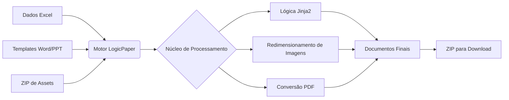

# LogicPaper | Motor de Geração de Documentos


<div align="center">
  <a href="README.md"><strong>Read in English</strong></a>
</div>

> **Automatize a criação de documentos Word, PowerPoint e PDF a partir de dados do Excel.**

---

## 📖 Visão Geral

**LogicPaper** é uma ferramenta projetada para automatizar fluxos de trabalho de criação de documentos. Ele recebe dados estruturados de arquivos Excel e preenche templates do Microsoft Office (`.docx`, `.pptx`) usando um sistema de templates customizado baseado em Jinja2.

Desenvolvido com **FastAPI** e **Docker**, ele fornece um painel web para gerenciar trabalhos em lote e inclui integração com LibreOffice (headless) para converter documentos gerados em formato PDF. É adequado para gerar contratos, relatórios, certificados e apresentações em escala.

### 🌟 Principais Recursos

* **Processamento em Lote:** Processa eficientemente múltiplas linhas de dados de arquivos Excel.
* **Suporte a Formatos:** Compatível com templates padrão de Word (`.docx`) e PowerPoint (`.pptx`).
* **Lógica de Templates:** Inclui filtros para manipulação de texto, aritmética de datas, formatação de moedas e lógica condicional diretamente dentro do template.
* **Gestão de Assets:** Suporta inserção dinâmica e redimensionamento de imagens (ex: fotos, assinaturas) a partir de um arquivo ZIP.
* **Conversão PDF:** LibreOffice integrado para conversão confiável de arquivos Office para PDF.
* **Painel Web:** Uma interface de usuário limpa para enviar arquivos, monitorar o progresso e baixar resultados.

---

## 🖼️ Prévia do Sistema

### Interface do Painel

*Interface Drag & Drop com logs de processo em tempo real.*

### Documentação & Ajuda

*Guia integrado para sintaxe de templates.*

---

## 🔄 Como Funciona



---

## 🚀 Início Rápido

### Pré-requisitos

* **Docker Desktop** (versão 20.10+)
* **Docker Compose**

### Instalação

1.  **Clonar o Repositório**
    ```bash
    git clone [https://github.com/rubensbraz/LogicPaper.git](https://github.com/rubensbraz/LogicPaper.git)
    cd LogicPaper
    ```

2.  **Iniciar o Motor**
    ```bash
    docker-compose up --build
    ```

3.  **Acessar a Aplicação**
    Abra seu navegador e navegue para:
    `http://localhost:8000`

---

## 🛠️ Estrutura do Projeto

O projeto separa a lógica de processamento (backend) da interface do usuário (frontend).

```text
LogicPaper/
├── app/
│   ├── core/
│   │   ├── engine.py          # Processamento de Documentos (docx/pptx/pdf)
│   │   ├── formatter.py       # Despachante de Filtros
│   │   ├── validator.py       # Verificador de Templates
│   │   └── strategies/        # Módulos de Lógica de Formatação
│   │       ├── base.py
│   │       ├── date_std.py    # Formatação de Datas
│   │       ├── logic_std.py   # Lógica Condicional
│   │       └── ...
│   ├── main.py                # Aplicação FastAPI
│   └── utils.py               # Utilitários
├── static/                    # Assets do Frontend (HTML/CSS/JS)
├── data/                      # Volume Docker para Dados
├── Dockerfile                 # Definição da Imagem
└── docker-compose.yml         # Orquestração de Containers
```

---

## 📘 Sintaxe de Templates

LogicPaper usa o caractere pipe (`|`) para aplicar filtros de formatação às variáveis.
*Para a lista completa de filtros, consulte a seção "How to Use" na aplicação ([Documentação no Github Pages](https://rubensbraz.github.io/LogicPaper/help.html)).*

### 1. Formatação de Texto
```jinja2
{{ client_name | format_string('upper') }}            -> "ACME CORP"
{{ client_id | format_string('prefix', 'ID: ') }}     -> "ID: 12345"
```

### 2. Números & Moeda
```jinja2
{{ contract_value | format_currency('USD') }}         -> "$ 1,500.00"
{{ tax_rate | format_number('percent', '2') }}        -> "12.50%"
{{ total | format_number('spell_out', 'en') }}        -> "one thousand five hundred"
```

### 3. Operações com Datas
```jinja2
{{ start_date | format_date('long') }}                -> "January 12, 2024"
{{ start_date | format_date('add_days', '30') }}      -> "2024-02-11"
```

### 4. Lógica Condicional
Mapeie códigos de status ou valores diretamente no documento:
```jinja2
{{ status_code | format_logic(
    '10=Approved',
    '20=Pending',
    'default', 'Unknown'
) }}
```

### 5. Mascaramento de Dados
```jinja2
{{ email | format_mask('email') }}                    -> "j***@domain.com"
```

### 6. Imagens
```jinja2
{{ photo_filename | format_image('3', '4') }}         -> (Redimensiona imagem para 3x4cm)
```

---

## 🧪 Testes

Um script utilitário está incluído para gerar dados de exemplo para fins de teste.

1.  **Gerar Dados de Exemplo (Dentro do Container):**
    ```bash
    docker exec -it logicpaper python /data/mock_data/generate_seeds.py
    ```
    *Isso cria `mock_data.xlsx`, `assets.zip`, e templates de exemplo na pasta de dados.*

2.  **Executar Teste:**
    Faça o upload dos arquivos gerados no painel para verificar a saída.

---

## ⚖️ Licença (CC BY-NC 4.0)

Este projeto está licenciado sob a **Licença Creative Commons Atribuição-NãoComercial 4.0 Internacional**.

[](http://creativecommons.org/licenses/by-nc/4.0/)

### Você tem o direito de:
* **Compartilhar:** Copiar e redistribuir o material em qualquer suporte ou formato.
* **Adaptar:** Remixar, transformar, e criar a partir do material.

### De acordo com os seguintes termos:
1.  **Atribuição:** Você deve dar o crédito apropriado a **Rubens Braz**, fornecer um link para a licença e indicar se mudanças foram feitas.
2.  **NãoComercial:** Você **NÃO** pode usar o material para fins comerciais (vender o software, usá-lo para serviços pagos ou integrá-lo em produtos comerciais).

*Para ver uma cópia desta licença, visite [http://creativecommons.org/licenses/by-nc/4.0/](http://creativecommons.org/licenses/by-nc/4.0/)*

---

## 👨‍💻 Autor

**Rubens Braz**

---

> *"Automação não é sobre preguiça; é sobre precisão."*