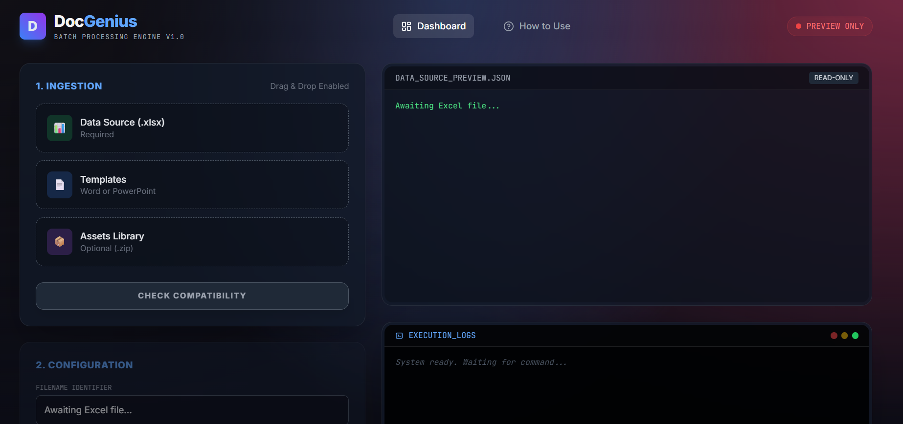
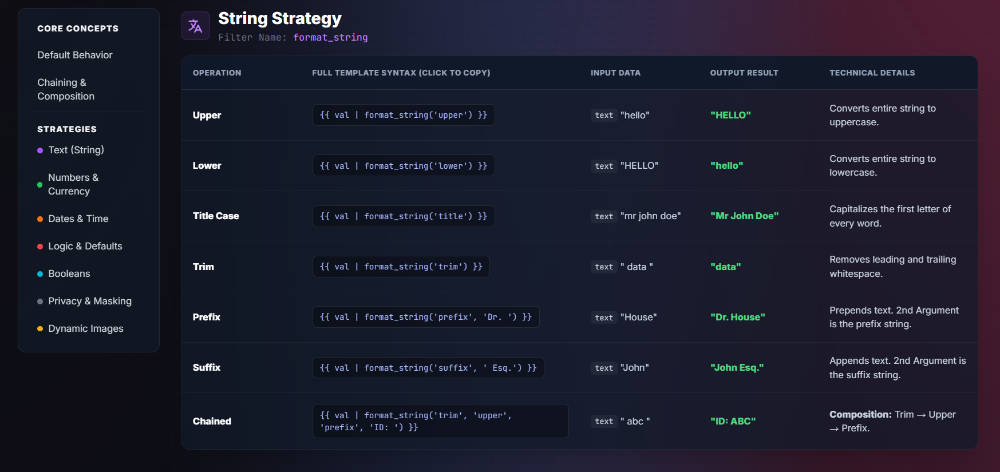
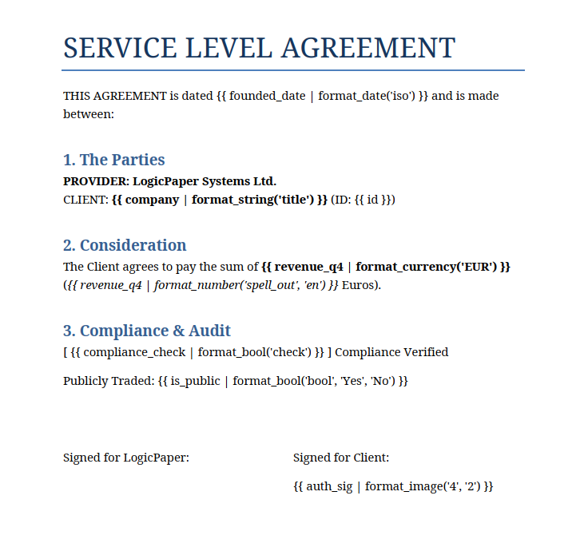
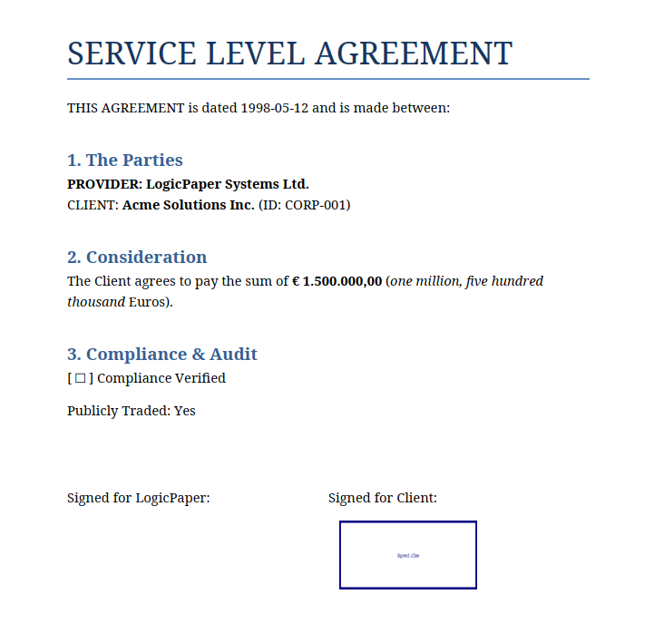
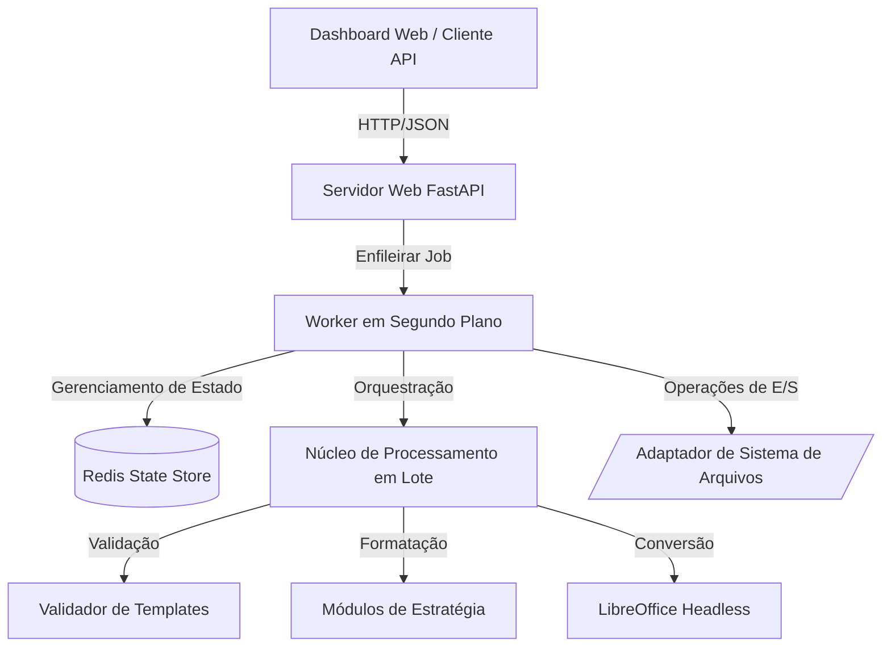

# LogicPaper | Motor de Geração de Documentos


<div align="center">
  <a href="README.md"><strong>Read in English</strong></a>
  <br><br>
  <a href="CONTRIBUTING.md"><strong>Guia para Contribuir (Apenas em inglês)</strong></a>
</div>

---

## 📖 Visão Geral

O **LogicPaper** é um motor de geração de documentos de alta performance, projetado para automatizar fluxos complexos de relatórios e contratos. Ele combina dados estruturados (Excel/JSON) com modelos de Microsoft Office (`.docx`, `.pptx`) ou arquivos de texto (`.md`, `.txt`) através de um sistema avançado de estratégias baseado em Jinja2.

A aplicação segue uma **Arquitetura Enterprise** (Arquitetura Hexagonal), utilizando **FastAPI** para alta concorrência, **Redis** para gerenciamento de estado e persistência de jobs, e **LibreOffice Headless** para conversão confiável de arquivos Office para PDF.

### 🖼️ Prévia do Sistema

### Interface da Dashboard


*Interface Drag & Drop com logs de processo em tempo real.*

### Documentação & Ajuda


*Guia integrado para sintaxe de templates.*

---

## 🌟 Principais Recursos

* **Processamento Assíncrono em Lote:** Gerenciamento de grandes volumes de dados via workers em segundo plano, evitando timeouts de requisição.
* **Suporte Multi-Formato:** Renderização nativa para Word, PowerPoint, Markdown e Texto Simples.
* **API de Integração:** Endpoints dedicados para integração com sistemas externos (ERP/CRM) via autenticação X-API-Key.
* **Persistência de Estado:** Rastreamento de jobs e gerenciamento de sessões utilizando Redis.
* **Estratégias de Formatação Complexas:** Filtros customizados para manipulação de strings, aritmética de datas, moedas localizadas e lógica condicional.
* **Gestão Dinâmica de Assets:** Extração, inserção e redimensionamento automático de imagens a partir de arquivos ZIP.
* **Conversão PDF:** Motor LibreOffice integrado para conversão de alta fidelidade para PDF.

---

## ⚡ Exemplo

Veja como o **LogicPaper** transforma dados brutos em documentos profissionais instantaneamente.

### 1. Dados de Entrada (JSON)

Estes são os dados simulados que alimentam o sistema:

```json
{
    "id": "CORP-001",
    "company": "Acme Solutions Inc.",
    "founded_date": "1998-05-12",
    "revenue_q4": "1500000.00",
    "is_public": "TRUE",
    "compliance_check": "FALSE",
    "auth_sig": "sig_valid.png"
}
```

### 2. Resultado Visual (Antes & Depois)

| Template (Entrada) | Documento Gerado (Saída) |
| :---: | :---: |
| **Model with Jinja2 Tags** | **Rendered PDF with Data** |
|  |  |
| [📄 Ver Template PDF](docs/files/contract_template.pdf) | [📃 Ver Resultado PDF](docs/files/contract_acme_result.pdf) |

---

## 🔄 Arquitetura do Sistema

O LogicPaper segue os princípios da **Arquitetura Hexagonal** (Portas e Adaptadores), garantindo separação limpa de responsabilidades e testabilidade.


```mermaid
graph TD
    Client[Dashboard Web / Cliente API] -->|HTTP/JSON| FastAPI[Servidor Web FastAPI]
    FastAPI -->|Enfileirar Job| Worker[Worker em Segundo Plano]
    Worker -->|Gerenciamento de Estado| Redis[(Redis State Store)]
    Worker -->|Orquestração| Core[Núcleo de Processamento em Lote]
    Core -->|Validação| Validator[Validador de Templates]
    Core -->|Formatação| Strategies[Módulos de Estratégia]
    Core -->|Conversão| LibreOffice[LibreOffice Headless]
    Worker -->|Operações de E/S| Storage[/Adaptador de Sistema de Arquivos/]
```

---

## 🛠️ Estrutura do Projeto

```text
LogicPaper/
├── app/
│   ├── core/                      # Camada de Domínio (Lógica de Negócio Pura)
│   │   ├── config.py              # Configuração da Aplicação (Pydantic Settings)
│   │   ├── engine.py              # Motor de Renderização de Documentos
│   │   ├── formatter.py           # Registro de Estratégias & Ponte Jinja2
│   │   ├── ports.py               # Interfaces Abstratas (Portas)
│   │   ├── service.py             # Orquestração de Processamento em Lote
│   │   ├── validator.py           # Verificador de Compatibilidade Template-Dados
│   │   ├── reporter.py            # Geração de Relatórios Excel
│   │   └── strategies/            # Estratégias de Formatação (Padrão Strategy)
│   │       ├── base.py            # Interface Abstrata de Estratégia
│   │       ├── string_std.py      # Manipulação de Texto
│   │       ├── number_std.py      # Formatação de Números & Moeda
│   │       ├── date_std.py        # Operações de Data/Hora
│   │       ├── boolean_std.py     # Conversão Booleana
│   │       ├── logic_std.py       # Lógica Condicional
│   │       ├── mask_std.py        # Mascaramento de Dados Privados
│   │       └── image_std.py       # Análise de Dimensões de Imagem
│   │
│   ├── integration/               # Camadas de Infraestrutura & Apresentação
│   │   ├── infrastructure.py      # Adaptadores (FileSystem, LibreOffice)
│   │   ├── state.py               # Repositório de Jobs Redis
│   │   ├── router.py              # Endpoints API Headless
│   │   ├── dashboard_router.py    # Endpoints API da UI Web
│   │   ├── worker.py              # Processadores de Jobs em Background
│   │   ├── schemas.py             # Modelos Pydantic Request/Response
│   │   ├── security.py            # Autenticação via Chave API
│   │   └── sse.py                 # Server-Sent Events (Logs em Tempo Real)
│   │
│   ├── dependencies.py            # Container de Injeção de Dependências
│   ├── main.py                    # Ponto de Entrada da Aplicação FastAPI
│   └── utils.py                   # Utilitários Compartilhados & Agendadores
│
├── static/                        # Interface Frontend (HTML/CSS/JS)
│   ├── index.html                 # Dashboard Principal
│   ├── help.html                  # Página de Documentação
│   └── assets/                    # CSS, JS, Imagens
│
├── persistent_templates/          # Biblioteca de Templates para Acesso via API
├── data/                          # Volume Docker (Arquivos Temporários)
├── Dockerfile                     # Definição da Imagem do Container
├── docker-compose.yml             # Orquestração Multi-Container
└── .env                           # Configuração de Ambiente
```

### Principais Padrões de Design

* **Arquitetura Hexagonal**: Separação limpa entre domínio e infraestrutura
* **Injeção de Dependências**: Sistema DI do FastAPI para baixo acoplamento
* **Padrão Strategy**: Operações de formatação extensíveis
* **Padrão Repository**: Persistência de dados abstrata via portas
* **Padrão Adapter**: Implementações de infraestrutura das portas de domínio

---

## 🚀 Início Rápido

### Pré-requisitos

* **Docker Desktop** (20.10+)
* **Docker Compose**

### Instalação e Execução

1. **Clonar o Repositório**

    ```bash
    git clone https://github.com/rubensbraz/LogicPaper.git
    cd LogicPaper
    ```

2. **Configurar Ambiente**
    Crie um arquivo `.env` baseado nas configurações do projeto (certifique-se de definir a `LOGICPAPER_API_KEY`).

3. **Iniciar os Serviços**

    ```bash
    docker-compose up --build
    ```

4. **Acesso**
    * **Dashboard UI:** `http://localhost:8000`

---

## 💻 Integração via API

O LogicPaper fornece uma camada de integração dedicada para sistemas externos.

* **Documentação:** `http://localhost:8000/docs` (Interface Interativa Swagger)
* **Autenticação:** Header `X-API-Key`.
* **Fluxo:** Envie o payload JSON com os dados e o caminho do template; receba um `job_id` para consultar o status e baixar o resultado final.
* **Suporte a Assets:** Campo opcional `assets_base64` para fornecer um ZIP de imagens para substituição dinâmica.

---

## 📘 Sintaxe de Templates

LogicPaper usa o caractere pipe (`|`) para aplicar filtros de formatação às variáveis.
*Para a lista completa de filtros, consulte a seção "How to Use" na aplicação ([Documentação no Github Pages](https://rubensbraz.github.io/LogicPaper/help.html)).*

### 1. Formatação de Texto

```jinja2
{{ client_name | format_string('upper') }}         -> "ACME CORP"
{{ client_id | format_string('prefix', 'ID: ') }}  -> "ID: 12345"
```

### 2. Números & Moeda

```jinja2
{{ contract_value | format_number('currency', 'USD') }}  -> "$ 1,500.00"
{{ tax_rate | format_number('percent') }}                -> "12.50%"
{{ total | format_number('spell_out', 'en') }}           -> "one thousand five hundred"
```

### 3. Operações com Datas

```jinja2
{{ start_date | format_date('long', 'en') }}      -> "January 12, 2024"
{{ start_date | format_date('add_days', '30') }}  -> "2024-02-11"
```

### 4. Lógica Condicional

Mapeie códigos de status ou valores diretamente no documento:

```jinja2
{{ status_code | format_logic(
    '10=Approved',
    '20=Pending',
    'default', 'Unknown'
) }}
```

### 5. Mascaramento de Dados

```jinja2
{{ email | format_mask('email') }}                    -> "j***@domain.com"
```

### 6. Imagens

```jinja2
{{ photo_filename | format_image('3', '4') }}         -> (Redimensiona imagem para 3x4cm)
```

---

## 🤝 Contribuição

O **LogicPaper** é um projeto de código aberto e adoramos receber contribuições da comunidade!

Caso você deseje implementar uma nova funcionalidade do **Roadmap**, corrigir um bug, ou aprimorar a documentação, por favor, consulte o [Guia para Contribuir (Apenas em inglês)](CONTRIBUTING.md) antes de começar.

---

## ⚖️ Licença (CC BY-NC 4.0)

Este projeto está licenciado sob a **Licença Creative Commons Atribuição-NãoComercial 4.0 Internacional**.

[](http://creativecommons.org/licenses/by-nc/4.0/)

### Você tem o direito de

* **Compartilhar:** Copiar e redistribuir o material em qualquer suporte ou formato.
* **Adaptar:** Remixar, transformar, e criar a partir do material.

### De acordo com os seguintes termos

1. **Atribuição:** Você deve dar o crédito apropriado a **Rubens Braz**, fornecer um link para a licença e indicar se mudanças foram feitas.
2. **NãoComercial:** Você **NÃO** pode usar o material para fins comerciais (vender o software, usá-lo para serviços pagos ou integrá-lo em produtos comerciais).

*Para ver uma cópia desta licença, visite [http://creativecommons.org/licenses/by-nc/4.0/](http://creativecommons.org/licenses/by-nc/4.0/)*

---

## 👨‍💻 Autor

**[Rubens Braz](https://rubensbraz.com/)**

> *"Automação não é sobre preguiça; é sobre precisão."*
